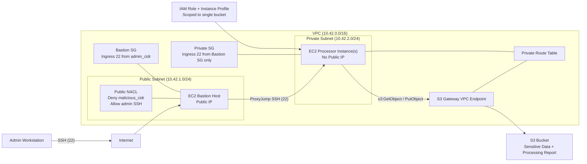

# Fort Knox Private Data Processor

This project implements the architecture from `NOTES.md`:

- Private data processing EC2 instance(s) in a **private subnet** (no public IP)
- Public bastion host for controlled SSH access
- **S3 Gateway VPC Endpoint** for private S3 access without NAT Gateway cost
- Public subnet NACL with explicit deny for a known malicious CIDR
- Security Groups enforcing SSH least privilege (admin -> bastion -> private)
- EC2 instance profile with scoped read/write access to one S3 bucket
- Ansible playbook that reaches private hosts through bastion and processes S3 data

## Service Diagram



## Repository Layout

- `terraform/`: AWS infrastructure as code
- `ansible/process_data.yml`: Configures and runs data-processing flow on private host(s)
- `ansible/inventory.ini.example`: Jump-host inventory example
- `scripts/upload_sensitive_data.sh`: Upload helper for seed file
- `sensitive_data.txt`: Sample data object to upload

## Prerequisites

- Terraform >= 1.5
- AWS CLI configured (`aws sts get-caller-identity` should succeed)
- Ansible installed locally
- Existing AWS EC2 key pair
- Use processor AMI `ami-0f3caa1cf4417e51b` (includes compatible Python + AWS CLI) via `processor_ami_id` in `terraform.tfvars`

## 1) Provision Infrastructure (Terraform)

```bash
cd terraform
cp terraform.tfvars.example terraform.tfvars
# Edit terraform.tfvars values: admin_cidr, key_name, region, etc.
# Set processor_ami_id to ami-0f3caa1cf4417e51b.
terraform init
terraform plan
terraform apply
```

Capture outputs:

```bash
terraform output
```

Important outputs:

- `bucket_name`
- `bastion_public_ip`
- `private_instance_private_ips`

## 2) Upload Sensitive Data (AWS CLI)

From repo root:

```bash
./scripts/upload_sensitive_data.sh <bucket_name> ./sensitive_data.txt
```

## 3) Run Processing on Private Instance(s) via Bastion (Ansible)

Build an inventory from output values:

```bash
cp ansible/inventory.ini.example ansible/inventory.ini
# Replace placeholders:
# - BASTION_PUBLIC_IP
# - PRIVATE_INSTANCE_IP
# - key path
```

Run playbook:

```bash
ansible-playbook -i ansible/inventory.ini ansible/process_data.yml -e data_bucket_name=<bucket_name>
```

What the playbook does:

- verifies AWS CLI is available on the private instance
- downloads `sensitive_data.txt` from S3 over private networking
- creates a simple processing report
- uploads `processing_report.txt` back to the same bucket

## 4) Verify Result

```bash
aws s3 cp s3://<bucket_name>/processing_report.txt -
```

## 5) Cleanup

```bash
cd terraform
terraform destroy
```

## Notes on Security Design

- **NACLs** (stateless): public subnet has explicit deny on `malicious_cidr` before allow rules.
- **Security Groups** (stateful): private instances only accept SSH from bastion SG.
- **No NAT Gateway**: private subnet gets S3 access through a Gateway Endpoint route.
- **IAM least privilege**: instance role scoped to one bucket and its objects.
