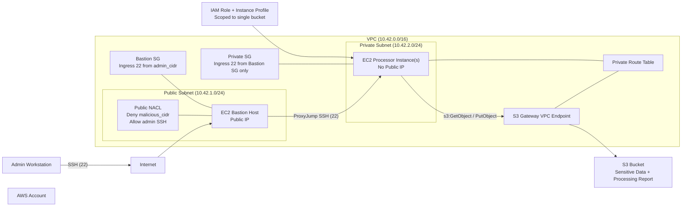

# Service Diagram

```mermaid
flowchart LR
    Admin["Admin Workstation"]
    Internet["Internet"]
    AWS["AWS Account"]

    subgraph VPC["VPC (10.42.0.0/16)"]
        subgraph PublicSubnet["Public Subnet (10.42.1.0/24)"]
            Bastion["EC2 Bastion Host\nPublic IP"]
            NACL["Public NACL\nDeny malicious_cidr\nAllow admin SSH"]
        end

        subgraph PrivateSubnet["Private Subnet (10.42.2.0/24)"]
            Processor["EC2 Processor Instance(s)\nNo Public IP"]
        end

        SG1["Bastion SG\nIngress 22 from admin_cidr"]
        SG2["Private SG\nIngress 22 from Bastion SG only"]
        S3Endpoint["S3 Gateway VPC Endpoint"]
        PrivateRT["Private Route Table"]
    end

    S3["S3 Bucket\nSensitive Data + Processing Report"]
    IAM["IAM Role + Instance Profile\nScoped to single bucket"]

    Admin -->|"SSH (22)"| Internet --> Bastion
    NACL --- Bastion
    SG1 --- Bastion

    Bastion -->|"ProxyJump SSH (22)"| Processor
    SG2 --- Processor

    Processor -->|"s3:GetObject / PutObject"| S3Endpoint
    S3Endpoint --- PrivateRT
    PrivateRT --- Processor
    S3Endpoint --> S3

    IAM --> Processor
```

